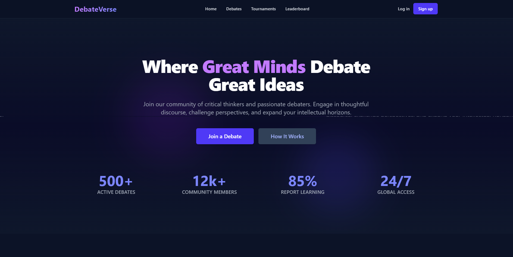
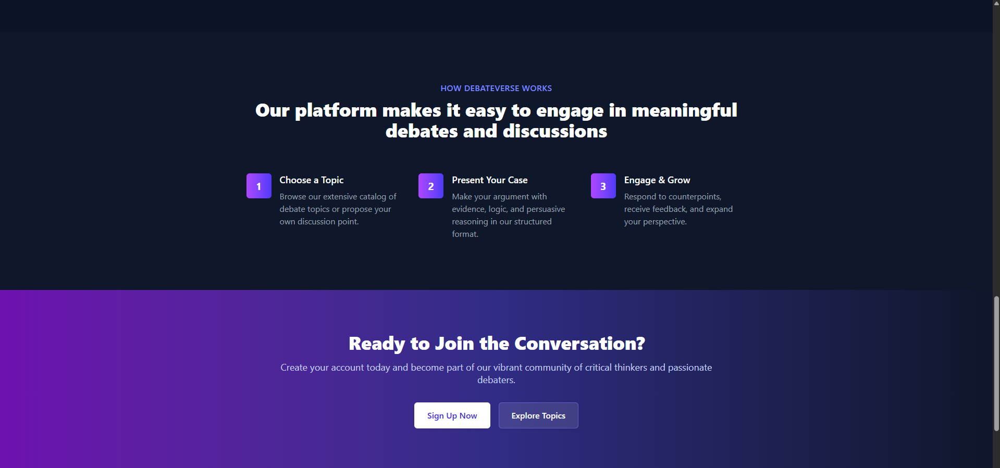
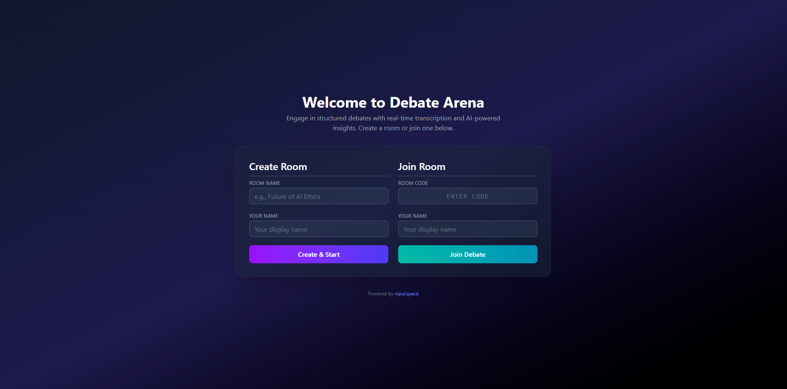
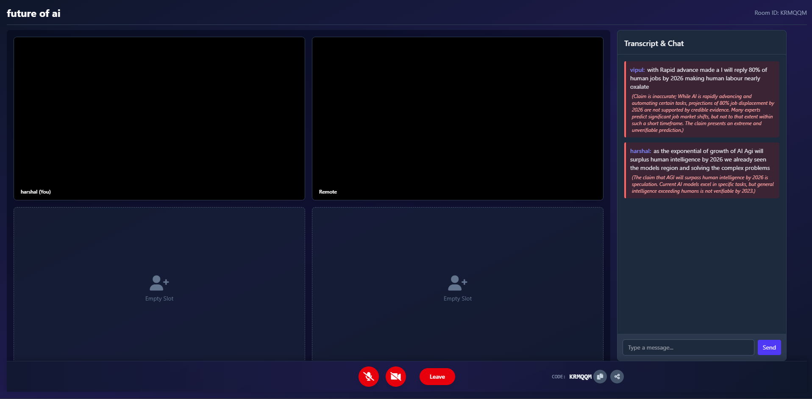
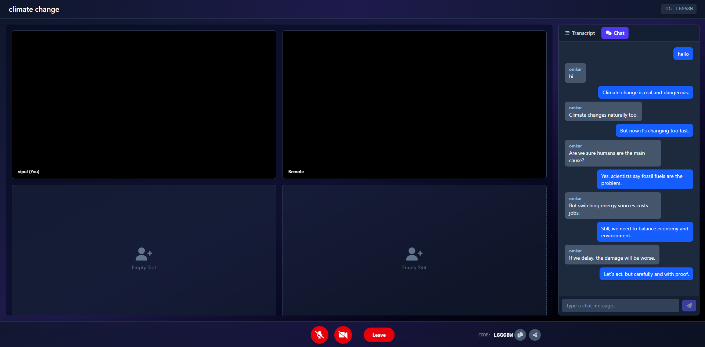

#🎙️ DebateVerse: Real-Time Video Debate Platform with AI Fact-Checking

[](https://reactjs.org/)
[](https://nodejs.org/)
[](https://firebase.google.com/)
[](https://webrtc.org/)
[](https://tailwindcss.com/)
[](https://ai.google.dev/)

DebateVerse is a web application enabling users to engage in real-time, 1-on-1 video debates on various topics. It features live transcription using the browser's Speech Recognition API and leverages Google's Gemini AI via a secure backend for real-time fact-checking of spoken statements during the debate.

## ✨ Features

*   **🏠 Landing Page:** Static introductory page showcasing features and available debates.
*   **🚪 Room Creation & Joining:** Users can create new debate rooms (generating a unique code) or join existing ones using a code.
*   **🎥 Real-time Video/Audio:** Peer-to-peer video and audio communication using WebRTC.
*   **✍️ Live Transcription:** Captures user speech using the Web Speech API and displays it in a dedicated transcript panel.
*   **🤖 AI Fact-Checking (via Secure Backend):** Transcribed statements are sent to a backend server, which securely queries the Google Gemini API to assess the factual accuracy or nature (opinion/speculation) of the claim.
*   **🚦 Fact-Check Display:** Transcripts are visually annotated (e.g., color-coded borders) based on the AI's fact-check result (Fact, Opinion/Inaccurate, Error).
*   **💬 Real-Time Chat:** Separate text-based chat functionality within the sidebar for participants to communicate via typing.
*   **🖱️ Basic Controls:** Mute/unmute microphone, turn camera on/off, leave/end room.
*   **🎨 Interactive UI:** Built with React and styled with Tailwind CSS for a modern look and feel.
*   **⚙️ State Management:** Uses React hooks (`useState`, `useEffect`, `useRef`, `useCallback`) and custom hooks (`useWebRTC`, `useSpeechRecognition`).
*   **📡 Signaling:** Firebase Firestore is used as the signaling server to exchange WebRTC connection details (offers, answers, ICE candidates) and transcript/chat messages between peers.

## 🚀 Technology Stack

**Frontend:**

*   **Framework/Library:** React ⚛️ (using Vite ⚡ for build tooling)
*   **Styling:** Tailwind CSS 🎨
*   **Real-time Communication:** WebRTC (Browser APIs) 🌐
*   **Speech-to-Text:** Web Speech API (Browser built-in) 🗣️
*   **State Management:** React Hooks ⚙️
*   **Firebase:** Firebase SDK (v9 Compat for Firestore) 🔥

**Backend:**

*   **Framework:** Node.js with Express.js 🟩
*   **API Calls:** `node-fetch` (to call Gemini API) ➡️
*   **Environment Variables:** `dotenv` (to securely manage API keys) 🔑
*   **CORS:** `cors` middleware 🛡️
*   **AI:** Google Gemini API (e.g., `gemini-1.5-flash-latest`) 🤖

**Signaling & Data:**

*   **Database/Signaling:** Google Firebase Firestore

## ⚙️ How It Works (Simplified Flow)

1.  **Landing:** User views the static landing page.
2.  **Initiation:** User clicks "Join a Debate" -> transitions to the Forms view.
3.  **Create/Join:** User fills in details (Name, Room Name/Code) on the Forms view.
4.  **Backend Setup:** Backend server starts, loading the secure Gemini API key from `.env`.
5.  **WebRTC Setup:**
    *   User media (camera/mic) is accessed.
    *   App connects to Firebase Firestore.
    *   Based on room status (new/existing), creates/retrieves WebRTC offer.
    *   Exchanges offer/answer and ICE candidates via Firestore to establish a peer-to-peer connection.
6.  **In Room:** Video/audio streams are active between peers.
7.  **Transcription & Fact-Check:**
    *   Local user speaks; Web Speech API transcribes the text.
    *   The transcribed text is sent from the Frontend to the Backend API (`/api/fact-check`).
    *   Backend receives text, adds the secure Gemini API key, and calls the Gemini API.
    *   Gemini responds with a fact-check result (e.g., `{ isFact: true, reason: "..." }`).
    *   Backend sends this result back to the Frontend.
    *   Frontend displays the transcript entry optimistically, then updates it with the fact-check result (color-coding/reason).
    *   Frontend sends the transcript + fact-check result to Firestore's `messages` subcollection for the room.
8.  **Receiving Transcripts:** Firestore listener (`onSnapshot`) on the `messages` collection receives messages from the *other* participant and displays them with their fact-check status.
9.  **Controls:** Buttons toggle local mic/camera enabled state and trigger the hangup/cleanup process.
10. **Hangup:** WebRTC connection is closed, media streams stopped, Firebase listeners detached, user is returned to the landing page. Creator potentially cleans up Firestore room data.

## 📸 Screenshots

Here's a glimpse of the DebateVerse platform:

**Landing Page (Hero & Stats):**

)
*Caption: The main landing page introducing DebateVerse and showing key stats.*

---

**Landing Page (Featured Debates):**


*Caption: Users can browse featured debate topics.*

---

**Create/Join Forms:**

)
*Caption: Simple forms for creating a new debate or joining an existing one.*

---

**In-Room Debate Interface:**

)
*Caption: The main debate screen showing video feeds, the live transcript with AI fact-checking annotations, and user controls.*

---

**Real-Time Live Chat:**
  
*Seamless real-time messaging between participants during debates.*

## 🛠️ Setup & Installation

**Prerequisites:**

*   [Node.js](https://nodejs.org/) (v18 or later recommended)
*   [npm](https://www.npmjs.com/) or [yarn](https://yarnpkg.com/)
*   [Git](https://git-scm.com/)
*   **Firebase Project:** Create a project on [Firebase Console](https://console.firebase.google.com/).
    *   Enable **Firestore Database** (start in **Test Mode** for easy development, but set proper security rules for production).
    *   Register a **Web App** and copy the configuration details.
*   **Google Cloud / AI Studio Account:**
    *   Create or use a Google Cloud project.
    *   Enable **Billing** for the project (required for most APIs, even within free tier).
    *   Enable the **"Generative Language API"** (and potentially "Vertex AI API") under "APIs & Services".
    *   Create an **API Key** under "APIs & Services" -> "Credentials". **Do not add restrictions** initially for easier setup.

**Steps:**

1.  **Clone the Repository:**
    ```bash
    git clone https://github.com/vipul-space23/Debate-Arena.git
    cd <frontend>
    cd <backend>
    ```

2.  **Backend Setup:**
    ```bash
    cd backend
    npm install
    ```
    *   Create a `.env` file in the `backend` directory:
        ```env
        # backend/.env
        GEMINI_API_KEY=YOUR_GOOGLE_GEMINI_API_KEY_HERE
        PORT=3000
        ```
    *   **Replace `YOUR_GOOGLE_GEMINI_API_KEY_HERE` with your actual, valid API key.**
    *   **(IMPORTANT): Add `backend/.env` to your main `.gitignore` file to avoid committing your secret key!**

3.  **Frontend Setup:**
    ```bash
    cd ../frontend
    npm install
    ```
    *   Edit `frontend/src/firebaseConfig.js`.
    *   Replace the placeholder values in the `firebaseConfig` object with the configuration details you copied from your Firebase Web App setup.

## ▶️ Running the Application

1.  **Start the Backend Server:**
    ```bash
    cd backend
    node server.js
    # Keep this terminal running
    ```
    *(You should see "Fact-checking backend server listening on http://localhost:3000")*

2.  **Start the Frontend Development Server:**
    *   Open a **new** terminal window.
    ```bash
    cd frontend
    npm run dev
    # Keep this terminal running
    ```
    *(Vite will usually start the server on `http://localhost:5173`)*

3.  **Access the App:** Open your web browser and navigate to the URL provided by Vite (e.g., `http://localhost:5173`).

## ⚙️ Configuration

*   **Backend (`backend/.env`):**
    *   `GEMINI_API_KEY`: Your secret API key for accessing the Google Gemini service. **Keep this secure and never commit it.**
    *   `PORT`: The port the backend Express server will listen on (defaults to 3000 if not set).
*   **Frontend (`frontend/src/firebaseConfig.js`):**
    *   Contains the necessary keys and IDs to connect your frontend application to your specific Firebase project for Firestore access.


## 🔒 Security Considerations

*   **API KEY SECURITY:** The `GEMINI_API_KEY` is stored **only** on the backend server in the `.env` file. This file **MUST NOT** be committed to version control (Git). The frontend **never** sees this key directly; it communicates with the backend, which handles the secure API call.
*   **Firebase Security Rules:** The current setup likely uses Firebase Firestore's default "Test Mode" rules, which allow open read/write access for 30 days. For any production or shared environment, you **MUST** configure [Firestore Security Rules](https://firebase.google.com/docs/firestore/security/get-started) to properly restrict access to data (e.g., only allow authenticated users to write to specific rooms).
*   **CORS:** The backend `cors()` middleware is currently set up permissively for development. In production, you should configure it to only allow requests from your deployed frontend's specific origin URL: `app.use(cors({ origin: 'YOUR_FRONTEND_DEPLOYMENT_URL' }));`.

## 🌱 Future Improvements

*   👨‍👩‍👧‍👦 Multi-participant support (>2) using an SFU (e.g., Mediasoup, LiveKit).
*   💾 Persistent Chat History.
*   👤 Participants List display.
*   ✨ More robust error handling & UI feedback.
*   🚀 Deployment Guides (Vercel, Netlify, Cloud Run).
*   🧠 Refined fact-checking prompts / Model selection.
*   🗄️ Database structure for past debates.
*   🧪 Unit & Integration Tests.

---

*Remember to replace placeholder information like `https://github.com/vipul-space23/Debate-Arena.git` and add details specific to your project if needed.*
